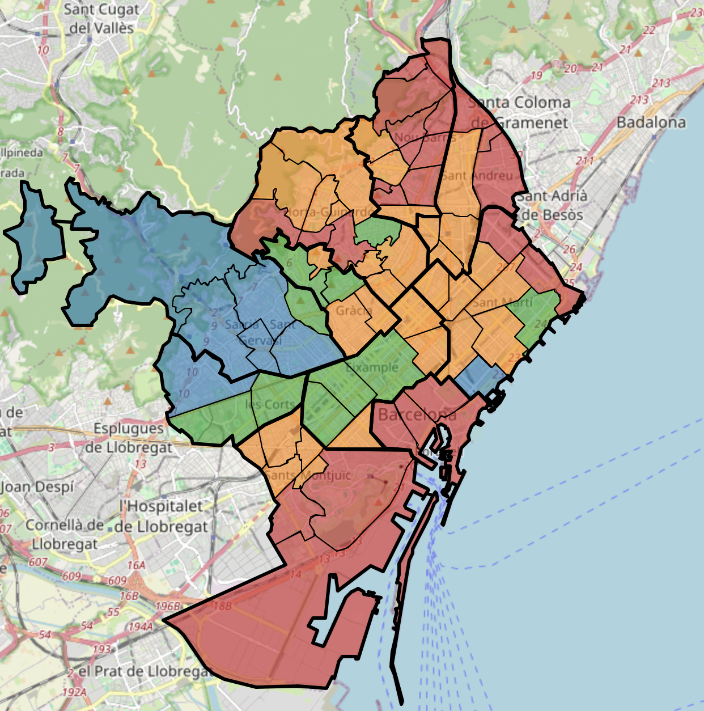
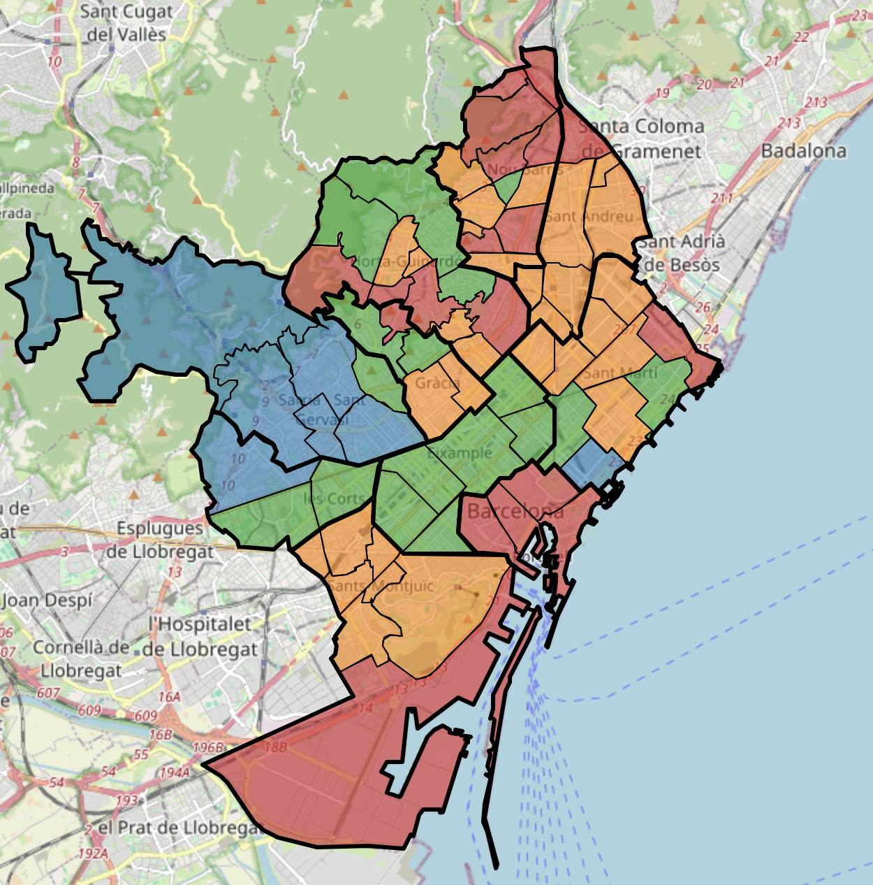

# Mining Barcelona's neighborhoods
In this project, I mined data of each of the 73 neighborhoods of Barcelona, including their demographics, the services they have (hospitals, pharmacies) as well as other variables like: extension of green areas, number of hotels, etc., in order to see similitudes or differences between neighborhoods. We also used these indicators to see if we were able to predict the income of these neighborhoods using different models (supervised and unsupervesied), like K-Means, DBSCAN, SVD or Decision Trees.

The project is organized in two self-explanatory jupyter notebooks (with html version). Please go through them, they will guide you throught the project.

* Part 1: Contains Aims, and ETL, and primary data analysis including PCA. ([Notebook](https://github.com/ulisesrey/mining_barcelona/blob/main/PR1/05.584-PRA1_UlisesRey.ipynb) / [Html](https://github.com/ulisesrey/mining_barcelona/blob/main/PR1/05.584-PRA1_UlisesRey.html))

* Part 2: Contains assesment of different models and global conclusions ([Notebook](https://github.com/ulisesrey/mining_barcelona/blob/main/PR2/05.584-PRA2_UlisesRey.ipynb) / [Html](https://github.com/ulisesrey/mining_barcelona/blob/main/PR2/05.584-PRA2_UlisesRey.html))

Example: Prediction of neighborhood income based on all available features, using the best Single Vector Decomposition (SVD) via GridSearch.

Income Legend:

 `Very High`
 `High`
 `Medium`
 `Low`

  

    
<strong>Ground Truth</strong>

    
  

  

    
<strong>SVC Prediction</strong>

    
  

SVC Test Accuracy: 0.45
SVC Test Precision: 0.57
SVC Test F1_score: 0.48

Check the html files for interactive maps!
