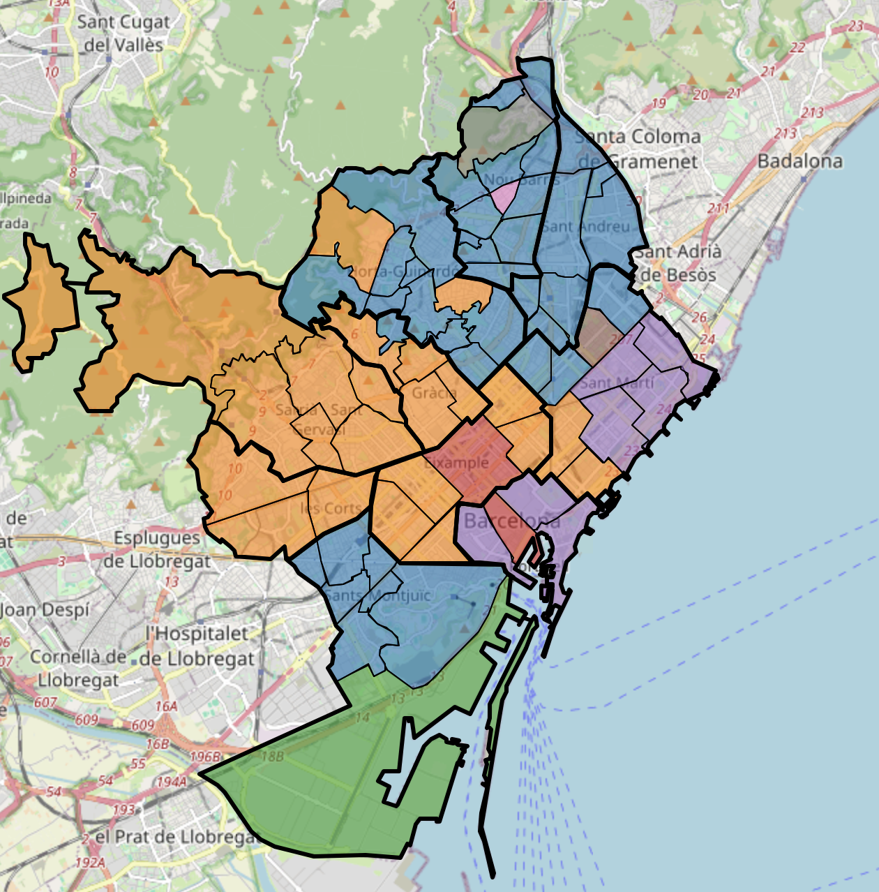

# Mining Barcelona's neighborhoods
In this project, I mined data of each of the 73 neighborhoods of Barcelona, including their demographics, the services they have (hospitals, pharmacies) as well as the extension of green areas, in order to see similitudes or differences between neighborhoods. We also used these indicators to see if we were able to predict the income of these neighborhoods using different models (supervised and unsupervesied), like K-Means, DBSCAN, or Decision Trees.

The project is organized in two self-explanatory jupyter notebooks (with html version). Please go through them, they will guide you throught the project.

* Part 1: Contains Aims, and ETL, and primary data analysis including PCA. ([Notebook](https://github.com/ulisesrey/mining_barcelona/blob/main/PR1/05.584-PRA1_UlisesRey.ipynb) / [Html](https://github.com/ulisesrey/mining_barcelona/blob/main/PR1/05.584-PRA1_UlisesRey.html))

* Part 2: Contains assesment of different models and global conclusions ([Notebook](https://github.com/ulisesrey/mining_barcelona/blob/main/PR2/05.584-PRA2_UlisesRey.ipynb) / [Html](https://github.com/ulisesrey/mining_barcelona/blob/main/PR2/05.584-PRA2_UlisesRey.html))

Example: Prediction of neighborhood income based on all features, using 8 cluster in K-means.
#

